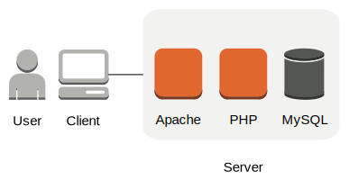

# WordPress Bootcamp
Course outline for the Seattle General Assembly WordPress Bootcamp.

[WordPress Bootcamp Chat](http://stupidchatapp.herokuapp.com/c/wpbootcamp)

## Table of Contents
* [Overview](#overview)
* [Setting Up Your Development Environment](#setting-up-your-development-environment)
* [Creating a Child Theme](#creating-a-child-theme)
* [Uploading to a Server](#uploading-to-a-server)
* [HTML Example](#html-example)
* [PHP Example](#php-example)
* [Useful Resources](#useful-resources)
* [Glossary](./glossary.md)

## Overview

### What is WordPress?
WordPress is an open source publishing platform that powers over 20% of the web. It began as a blogging platform, and has grown into a full-fledged content management system (CMS).

### WordPress.com vs WordPress.org

#### WordPress.com
Software as a Service (SaaS)

##### Pros
- Turn-key
- No need to worry about infrastructure
- Hard to break

##### Cons
- Restricted functionality
- Limited plugin/theme library

### WordPress.org
Self-managed system

##### Pros
- Highly customizable
- Total control of content
- Full plugin/theme library

##### Cons
- Self-managed
- No support

## How The Internet Works
A quick overview of how a browser communicates with a website.

1. The browser makes a request to a server by asking for a URL.
  * a 'GET' request.
2. The server receives the request.
  * if the request doesn't make sense, it responds with an error message (404, 500, etc).
  * if the request can be processed, send back some HTML.
3. The browser receives the HTML.
4. The browser parses the HTML and applies CSS.

## Setting up your development environment
### OS X/Mac
1. Download the [WordPress Core](https://wordpress.org/download/) files.
2. Drag the `wordpress` folder from `Downloads` into `Documents`.
3. Install [Sublime Text 3](http://www.sublimetext.com/)
  - Drag the Sublime Text icon from your `Downloads` folder to your `Applications` folder.
4. Install [MAMP](https://www.mamp.info/):
  1. Download the package.
  2. Double click the file to begin the installation wizard.
  3. Keep the default settings.
  4. Enter your password if prompted.
5. Configure MAMP
  1. Click 'Applications' -> 'MAMP' -> 'MAMP' to start MAMP
  2. Click 'Preferences'
  3. Under 'Web Server' click the folder next to 'Document Root'
  4. Navigate to 'Documents' and select your 'wordpress' folder.
  5. Click 'Select'.
  6. Click 'OK'
  7. Click 'Start Servers'
6. Create a database
  1. In your browser, navigate to [http://localhost:8888/MAMP](http://localhost:8888/MAMP)
  2. Click the link to 'phpMyAdmin' (below MySQL).
  3. Click the 'Databases' tab in the top row.
  4. Enter `wordpress` in the 'Database name' text field.
  5. Click 'Create'.
7. Install WordPress
  1. In your browser, navigate to [http://localhost:8888](http://localhost:8888/)
  2. Select your language and click 'Continue'
  3. Click 'Let's go!'
  4. Enter the following information:
    - Database Name: `wordpress`
    - User Name: `root`
    - Password: `root`
    - Database Host: `localhost`
    - Table Prefix: `wp_`
  5. Click 'Submit'.
  6. Click 'Run the install'.
  7. Enter the following information:
    - Site Title: `WordPress Bootcamp`
    - Username: `admin`
    - Password: `admin`
    - Your E-mail: `[your email address]`
  8. Click 'Install WordPress'.
  9. Click 'Log In'.
  10. Enter the following information:
    - Username: `admin`
    - Password: `admin`

### Toggle Developer Mode In Safari
1. Open Safari.
2. 'Safari' -> 'Preferences' -> 'Advanced' -> 'Show Develop menu in menu bar'

## Creating a Child Theme
For a more in-depth tutorial, visit the [WordPress Codex Article](https://codex.wordpress.org/Child_Themes).

1. Open Sublime Text.
2. Click 'File' -> 'Open'
3. Navigate to your WordPress directory (`Documents/wordpress`).
4. Use the sidebar to navigate to `wp-content/themes`.
5. Create a new folder named `twentyfifteen-child`.
6. Create a file in `twentyfifteen-child` named `style.css`.
  - Copy the child theme header template from the Codex into `style.css` and save the file.
  - [Example](./examples/twentyfifteen-child/style.css)
7. Create a file in `twentyfifteen-child` named `functions.php`.
  - The file must begin with `<?php`.
  - On the next line, copy the `wp_enqueue_scripts` code snippet from the Codex into `functions.php` and save the file.
  - [Example](./examples/twentyfifteen-child/functions.php)
8. Navigate to your WordPress Admin panel -> 'Appearance' -> 'Themes'
9. Select your new child theme.

## Uploading to a Server
In this class, we will be using an FTP client named 'Filezilla' to transfer our files between our development and production environments.

### Transfering files with Filezilla
1. Open Filezilla.
2. Enter the following information in the top bar:
  1. Host: `FTP Host`
  2. Username: `FTP Username`
  3. Password: `FTP Password`
  4. Port: [blank]
3. Click 'quickconnect'.
4. Check the 'Always trust certificate in future sessions' and click 'OK'.
5. In the local pane (bottom left), navigate to your local WordPress folder (`Documents/wordpress`).
6. Drag the contents of the WordPress folder to the remote pane (bottom right).

## HTML Example
1. Open the `example` package in Sublime Text
  * 'File' -> 'Open'
3. Set the MAMP Document Root to `example/html`.
  * MAMP -> 'Preferences' -> 'Web Server'
4. In your browser, navigate to [http://localhost:8888](http://localhost:8888).
5. View the page source.
  * Use the URL [view-source:http://localhost:8888/](view-source:http://localhost:8888/)
  * Keyboard shortcuts:
    - Chrome: `cmd + option + u`
    - Firefox: `cmd + u`
    - Safari: `cmd + option + u`
      * Not working? [Toggle developer mode in Safari](#toggle-developer-mode-in-safari)
6. Leave these pages open to compare with the results from the next section.

## PHP Example
1. Open the `example` package in Sublime Text
2. Set the MAMP Document Root to `example/php`.
3. In your browser, navigate to [http://localhost:8888](http://localhost:8888).
4. View the page source.
  * Use the URL [view-source:http://localhost:8888/](view-source:http://localhost:8888/)
  * Keyboard shortcuts:
    - Chrome: `cmd + option + u`
    - Firefox: `cmd + u`
    - Safari: `cmd + option + u`
      * Not working? [Toggle developer mode in Safari](#toggle-developer-mode-in-safari)
5. Compare the source of HTML and PHP examples to verify that they are the same.

## Useful Resources
* [WordPress Codex](https://codex.wordpress.org/)
* [W3C School](http://www.w3schools.com/)
* [CSS Tricks Blog](https://css-tricks.com/)
* [Codepen.io](http://codepen.io/)
